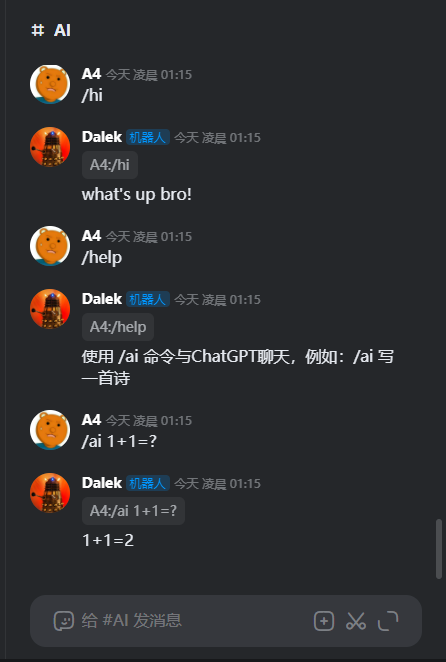

# chatgpt-kook-bot
> A Kook(aka. KaiHeiLa) bot framework with chatgpt official api

## 1 概览 / Overview
Kook（原名. 开黑啦），这是一个适用于kook的ChatGPT机器人框架，依赖于以下项目:

* Kook SDK: https://github.com/TWT233/khl.py
* ChatGPT API: https://github.com/acheong08/ChatGPT

使用前可以先查看以下文档学习必要的基础知识：

* kook官方开发文档： https://developer.kookapp.cn/doc/intro
* SDK文档：https://github.com/TWT233/khl.py/tree/main/example



## 2 部署方式 / Deploy
**推荐使用docker-compose**

### 2.1 配置config.json

项目目录下有一个示例配置文件 **config.json.example**，请复制一份config.json到同级目录，然后按需修改

```json 
{
  "kook_token": "",  // kook的机器人token，详情见kook开发文档：https://developer.kookapp.cn/doc/intro
  "port": 5000,
  "openai_api_key": "", // OpenAI的token，请自行准备账号
  "openai_engine": ""  // 可不填，目前默认为GPT-3.5-turbo
}
```

然后通过docker-compose启动即可：

```shell
docker-compose up -d
```

## 3 机器人指令 / Commands

目前实现了以下几个命令：

```
/hi 机器人给予默认答复，可用于确认机器人已可以正确响应请求
/help 帮助信息
/ai 调用ChatGPT来回答问题
```